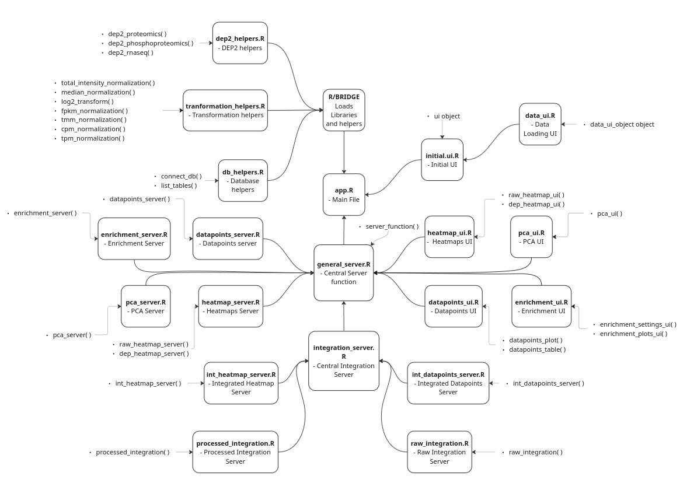

# BRIDGE

[](https://bridge-paulilab.readthedocs.io/en/latest/?badge=latest)

## Overview

BRIDGE is a user-friendly app that enables scientists to **explore, analyze and integrate multi-omics datasets** (proteomics, phosphoproteomics and RNA-seq) interactively, privately and without the need of programming skills. It supports both **individual** and **integrative** analysis of datasets and generates interactive visualizations such as heatmaps, volcano plots, and time-course. BRIDGE is especially powerful for identifying shared biological signals across different omics layers. 

## Documentation

This repository includes an MkDocs documentation scaffold under `docs/` and `mkdocs.yml`, including:

- introduction and installation pages
- installation and database-generation setup
- strict data requirements and loading workflow
- one page per analysis module
- dedicated raw and processed integration guides
- practical examples and FAQ

To build docs locally:

```bash
python -m pip install -r docs/requirements.txt
python -m mkdocs serve
```

Documentation is also hosted on readthedocs, see documentation status badge.

## Run from container
Simply run 
```bash
docker run -d --rm --name bridge -p 3838:3838 --mount type=bind,src=${YOUR_DATABASE},dst=/srv/data/database.db ghcr.io/paulilab/bridge:latest
```
replacing ${YOUR_DATABASE} with the full path to a database of your choice.
You can use the test database [here](https://bridge.imp.ac.at) to get a first impression of the app or build a local version of test database with the table provided in [example_data](/example_data).

### Configure async workers (Docker / infrastructure tuning)

BRIDGE uses asynchronous workers for heavy tasks (e.g. some heatmaps, volcano, PCA, enrichment).

By default, BRIDGE uses a conservative cap of 2 workers. You can override this at runtime:

```bash
docker run -d --rm --name bridge \
  -p 3838:3838 \
  -e BRIDGE_FUTURE_WORKERS=4 \
  -e BRIDGE_FUTURE_MAX_WORKERS=4 \
  --mount type=bind,src=${YOUR_DATABASE},dst=/srv/data/database.db \
  ghcr.io/paulilab/bridge:latest
```

Optional backend selection:

```bash
-e BRIDGE_FUTURE_BACKEND=multisession
```

Recommended starting point:
- start with 2 workers
- increase to 3-4 on larger machines if multiple users run heavy analyses concurrently
- beyond that, gains may plateau because not all app workflows are parallelized

## Installation

In order to run `BRIDGE` locally there are some prerequisites to fulfill, like setting up the environment and creating the database.

**Requirements:** R >= 4.0.0, Python >= 3.7

All commands below assume you are running them from inside the cloned repository root (`BRIDGE/`).

### Setting up the environment

First, clone the git repository to your local machine.

```bash
git clone https://github.com/paulilab/BRIDGE
 ```

After copying the repository the environment has to be set up in R so all the libraries are available.

```R
renv::restore() 
```

Database creation requires Python. Install dependencies via pip:

```bash
pip install -r Python/requirements.txt
```

or use `conda/mamba/pixi` to create an environment from `Python/environment.yml`:

```bash
conda env create -n bridge -f Python/environment.yml
```

After this, your local computer will have all the files and required libraries

### Database creation

In order to use the app, a database is needed. Scripts and a stand-alone shiny-app are provided for the user to be guided through the process.
This can happen interactively or via command line as described next.

### Interactive database builder app (recommended)

To avoid running Python scripts manually, BRIDGE now includes a stand-alone Shiny app that wraps the database generation scripts interactively.

Start it with:

```bash
Rscript app_db_builder.R
```

It will open a local UI where you can:

- set or create the SQLite database path
- upload (or reference) raw CSV/TSV files
- preview columns to select identifier/datapoint indices
- build the database
- optionally attach processed `.rds` objects

By default it runs on port `3839`. You can override this with:

```bash
BRIDGE_DB_BUILDER_PORT=3840 Rscript app_db_builder.R
```

### Commandline creation of database

First, a `.db` file has to be created.

```bash
touch user_database.db
```
Then, after creating the empty database, it has to be filled with tables and annotation files, for that, two scripts are provided that will guide the user through the process.

```bash
python Python/db_adding.py
```

```bash
python Python/db_adding_annotation.py
```

Both scripts assume a specific structure in the input data. Please follow the rules below carefully before running them, both when curating your data and when building the database.

### Requirements for Your Data

Before submitting tables to the database, please ensure your data follows **all** of the rules below.  
If any rule is not met, the app will most likely crash.  

---

#### 1. File format
- The file **must be a CSV or TSV**.

#### 2. Identifier columns
- You must provide **at least 3 identifier columns**, with exact names:
  - `Gene_Name` (from gene name)
  - `Gene_ID` (from gene id)
  - `Protein_ID` (from protein id)  

All naming rules must be followed **strictly**.

#### 3. Value columns
- All value (measurement) columns must end with an integer specifying the replicate, **preceded by an underscore** (`_`).  
- **No additional underscores** are allowed in the column name.  
- For extra separation, use other symbols instead.  
- **You must select at least 2 conditions with at least 2 replicates each.** Differential expression analysis requires replicates to estimate variance and multiple conditions to compute contrasts.

Example:  
`X6.hpf_1`

#### 4. Missing values
- **No `NA`s** are allowed in any identifier columns.

#### 5. Table name
- The name of the table must follow this structure: 
`<species>_<datatype>_<optional info>_<id>`

Example:
`zebrafish_proteomics_test_1`

#### 6. Phosphoproteomics data
- An additional identifier is required: **the peptide with the mutation**, named `pepG`.  

Example:
`AAAGDEAGGsSR_p1_ac0`

#### 7. Processed data
- If you are adding processed data, ensure:
  - It is an object of class **`SummarizedExperiment`**.  
  - It was generated using the **same columns** as the raw table (for matching cache keys and tables).

###  Important Notes
- Read these rules carefully and verify that your database meets all requirements.  
- Otherwise, the app may fail to run properly.  

#### Required R packages:
- `storr`
- `DBI`
- `RSQLite`

> **Note:** These packages are included in the `renv` environment restored above. Only install them manually if you are running the database creation scripts outside of the `renv` environment.


## Usage

With the environment set up and a database created, start the app from the repository root:

```bash
Rscript app.R user_database.db
```

By default the app runs on port `3838`. Open `http://localhost:3838` in your browser.

You can also configure the port and async execution via command line flags:

```bash
Rscript app.R --workers=4 --max-workers=4 --backend=multisession user_database.db 3838
```

Flags:
- `<port>`: optional positional argument specifying the port (default: `3838`)
- `--workers=<n>`: requested worker count
- `--max-workers=<n>`: upper cap for workers (default is 2)
- `--backend=<auto|multisession|callr>`: async backend

## File structure

As said before, the code has been heavily modularized to ease the editing, debugging and improvement of the app.
This also allows the user to further locally customize the app with more pipelines or plots without the need of understanding and editing the whole code
but rather just changing the corresponding files.

Here is a diagram showing all the different code files and their hierarchy, including the functions declared in each file and a brief description of each module. The key modules are:

- **`app.R`** — entry point, wires UI and server together
- **`R/BRIDGE/R/`** — modular server and UI files, one per analysis type (heatmap, volcano, PCA, enrichment, integration, etc.)
- **`app_db_builder.R`** — stand-alone Shiny app for interactive database creation
- **`Python/`** — command-line scripts for database creation and annotation



## License

BRIDGE is released under the Apache license version 2. See [LICENSE](./LICENSE) for details.

## Citation

If you use BRIDGE in your research, please cite it as indicated in the repository or any associated publication.
