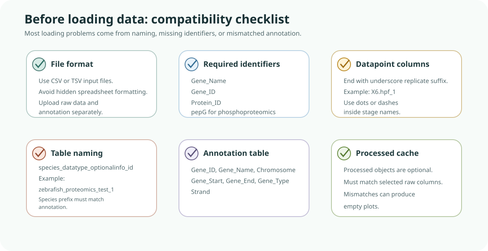

# Data Requirements

This is the most important page for avoiding setup issues.

General rules:

1. Input must be CSV or TSV.
2. Required identifiers for data tables:
   `Gene_Name`, `Gene_ID`, `Protein_ID`
3. Datapoint columns should end with an integer replicate suffix using underscore.
4. Identifier columns should not contain missing values.
5. Table name format:
   `<species>_<datatype>_<optional info>_<id>`
6. Phosphoproteomics requires `pepG`.
7. Processed objects should match the same raw-column selection used in BRIDGE.



*Requirements figure. A BRIDGE-compatible dataset needs a supported file format, required identifier columns, correctly named datapoint columns, consistent table naming, matching annotation, and compatible processed cache objects if those are provided.*

<details>
<summary>Help: how to use this checklist</summary>
<p>Before troubleshooting the app, check the dataset against this diagram from left to right. Most loading and empty-plot issues come from missing identifiers, table names that do not match the selected species, annotation metadata problems, or datapoint columns that do not follow the replicate suffix pattern.</p>
</details>

Datapoint naming example:

```text
X6.hpf_1
```

Avoid extra underscores in datapoint names. Use dots or dashes for additional separators.

Data table naming example:

```text
zebrafish_proteomics_test_1
```

Annotation table naming:

```text
<species>_annotation_<version>
```

Example:

```text
zebrafish_annotation_GRCz11
```

Required annotation columns:

- `Gene_ID`
- `Gene_Name`
- `Chromosome`
- `Gene_Start`
- `Gene_End`
- `Gene_Type`
- `Strand`

Quick validation checklist:

- Identifier columns exist and are non-empty.
- Phosphoproteomics includes `pepG`.
- Table names follow required format.
- Species prefix matches between data and annotation tables.
- Datapoint columns follow replicate naming pattern.
