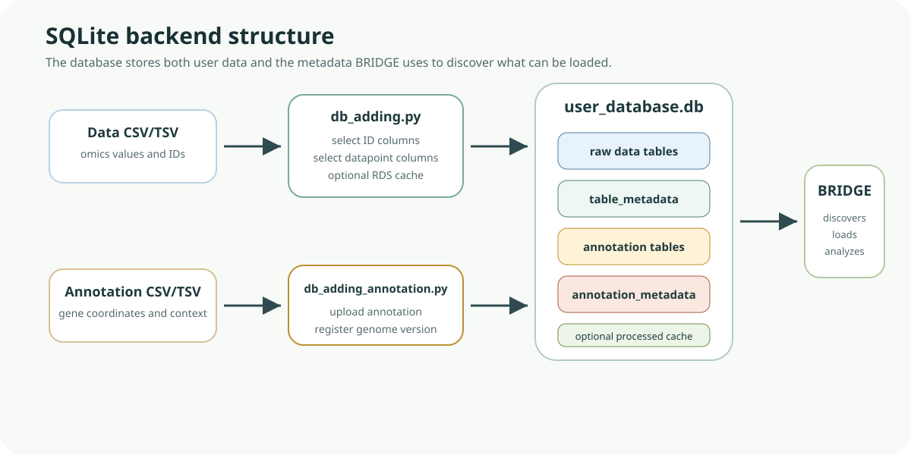

# Database Generation

BRIDGE uses a SQLite database as backend. This database stores:

- raw tables
- annotation tables
- metadata tables
- optional cached processed objects



*Database figure. The database-generation scripts upload raw data and annotation tables into SQLite, then register metadata tables that BRIDGE uses to discover available datasets, annotation versions, and optional cached processed objects.*

<details>
<summary>Help: how to read this database diagram</summary>
<p>The raw and annotation tables store the biological data. The metadata tables tell BRIDGE which tables exist, what species or datatype they belong to, and how they should be loaded. If a table exists in SQLite but is missing from the metadata, it may not appear in the app.</p>
</details>

## Recommended: interactive database builder

BRIDGE includes a stand-alone Shiny database builder app that wraps the two Python database-generation scripts in a local UI.

Use this route if you want to avoid running the Python scripts manually.

Start the builder from the project root:

```bash
Rscript app_db_builder.R
```

What the builder lets you do:

- set or create the SQLite database file path
- upload a raw CSV/TSV file, or provide a path to one on disk
- preview raw-table columns and choose 1-based identifier/datapoint column indices
- add a raw/omics table through `Python/db_adding.py`
- add an annotation table through `Python/db_adding_annotation.py`
- optionally attach a processed `.rds` object for cache-backed reuse
- inspect script output directly in the app

Builder requirements:

- R with `shiny`
- Python available as `python3` or `python`
- the `Python/db_adding.py` and `Python/db_adding_annotation.py` scripts present in the project
- optional: `shinyFiles` for filesystem browsing in the database-path selector

Recommended builder workflow:

1. Open the builder with `Rscript app_db_builder.R`.
2. Set the database file path, for example `user_database.db`.
3. Click `Create empty DB file`.
4. In `Raw / omics table`, select or enter the raw CSV/TSV path.
5. Click `Preview columns`.
6. Enter the raw database table name.
7. Enter identifier column indices and datapoint column indices.
8. Optionally attach a processed `.rds` object.
9. Click `Add raw table`.
10. In `Annotation table`, select or enter the annotation CSV/TSV path.
11. Enter the annotation table name.
12. Click `Add annotation table`.

After this, use the generated database when starting BRIDGE.

## Manual script workflow

You can still run the underlying scripts directly. This is useful for automation, debugging, or command-line workflows.

Create a new database file:

```bash
touch user_database.db
```

Step 1: add raw/omics data tables

```bash
python Python/db_adding.py
```

What `db_adding.py` does:

1. Loads a CSV/TSV file.
2. Lets you select identifier columns.
3. Lets you select datapoint columns.
4. Uploads the table to SQLite.
5. Registers metadata in `table_metadata`.
6. Optionally stores a processed R object in cache.

Step 2: add annotation tables

```bash
python Python/db_adding_annotation.py
```

What `db_adding_annotation.py` does:

1. Loads annotation CSV/TSV.
2. Uploads annotation table.
3. Registers it in `annotation_metadata`.

Re-running scripts:

- You can run both scripts as many times as needed.
- Uploading with the same table name replaces that table.
- Metadata entries are updated with `INSERT OR REPLACE`.

Optional CLI usage:

`db_adding.py` supports non-interactive flags such as:

- `--csv`
- `--db`
- `--table`
- `--id-cols`
- `--tp-cols`
- `--processed`
- `--rds`

`db_adding_annotation.py` supports:

- `--csv`
- `--db`
- `--table`
