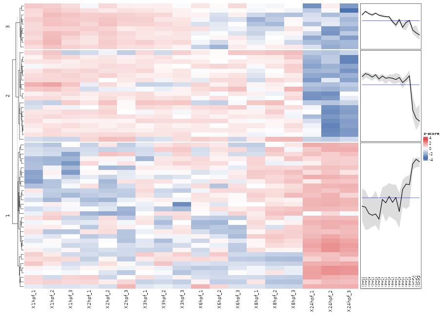

# DE Heatmap

Purpose:

- visualize differentially expressed features after processing
- explore cluster structure and significant patterns

Inputs:

- one loaded dataset
- selected contrast context from processed results
- p-value and LFC thresholds
- optional clustering settings and `k`

How to use:

1. Open `DE Heatmap`.
2. Set p-value and LFC cutoffs.
3. Enable/adjust clustering if needed.
4. Click compute.

Outputs:

- heatmap of significant features
- cluster-oriented view depending on settings
- table output for inspected values

Practical tips:

- Start with moderate thresholds to avoid empty output.
- If clusters are unstable, try fewer/more conservative features first.
- Use alongside Volcano Plot for consistency checks.

*Figure 2. DE Heatmap output after applying p-value and LFC thresholds. The heatmap groups significant features by similar expression patterns, while the side panels summarize the average trend for each cluster.*

Help: how to read this plot

Rows are features that passed the selected differential-expression thresholds, and columns are datapoints or replicates. Red and blue encode relative signal in opposite directions. Clusters help identify groups of features that rise or fall together, but the exact cluster structure depends on the selected thresholds and clustering settings.

