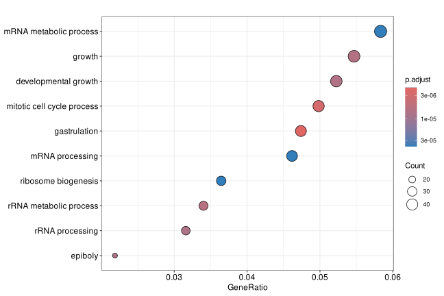

# Enrichment Analysis

Purpose:

- interpret significant features through pathway/function context

Inputs:

- one loaded dataset with processed output
- selected contrast
- selected enrichment database
- p-value and LFC cutoffs for significant feature definition

Supported enrichment choices:

- GO
- KEGG
- Reactome

How to use:

1. Open `Enrichment Analysis`.
2. Choose contrast and enrichment database.
3. Set thresholds.
4. Click compute.

Outputs:

- enrichment dot plot

Important notes:

- Enrichment requires enough significant hits.
- If very few significant features pass thresholds, results may be empty.
- Phosphoproteomics enrichment may be unavailable depending on data/object context.

*Figure 5. Enrichment Analysis dot plot. Terms on the y-axis represent enriched biological functions or pathways, GeneRatio shows the fraction of significant features associated with each term, point size reflects hit count, and color represents adjusted p-value.*

Help: how to read this plot

Prioritize terms with stronger adjusted significance, larger GeneRatio, and enough supporting features to be biologically credible. Very small counts can still be statistically significant, but they should be interpreted carefully and checked against the feature table and the selected contrast.

