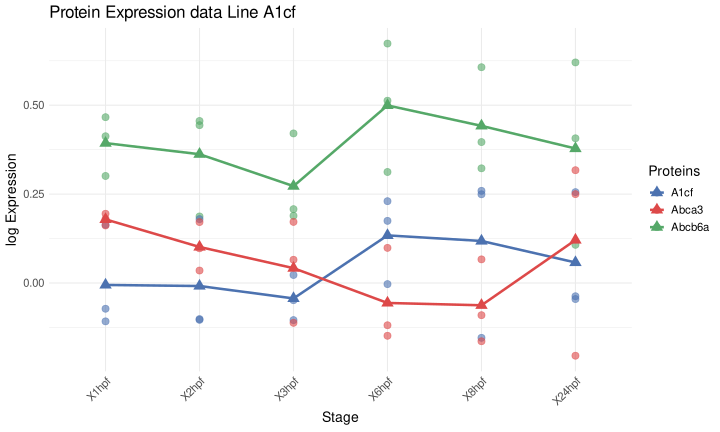

# Gene Expression

Purpose:

- inspect expression trajectories for selected genes across datapoints
- compare one or multiple genes in the same view

Inputs:

- one loaded dataset
- one or more selected genes
- selected transformation scale

Available transformations:

- Proteomics/phosphoproteomics:
  continuous, log-scale, total intensity, median normalization
- RNA-seq:
  continuous, log-scale, TPM, FPKM, TMM, CPM

How to use:

1. Open `Gene Expression`.
2. Search and select one or more genes.
3. Choose transformation/scale.
4. Inspect line/trend behavior across stages.

Outputs:

- gene-level trend plot
- corresponding table output for selected view

Practical tips:

- For phosphoproteomics, one gene may produce multiple peptide trends.
- Validate stage ordering and replicate naming in your input columns.
- Compare transformed and continuous views before conclusions.

*Figure 4. Gene Expression view for selected proteins across stages. Individual points show replicate-level values, and the connected markers summarize the stage-wise trend for each selected feature.*

Help: how to read this plot

Use this view to inspect candidate-level behavior after broader analyses such as PCA, heatmaps, or volcano plots. A convincing pattern usually combines a coherent trend across stages with reasonable replicate agreement. For phosphoproteomics, one gene can produce multiple peptide-level trends, so separate lines may represent related but distinct measurements.

