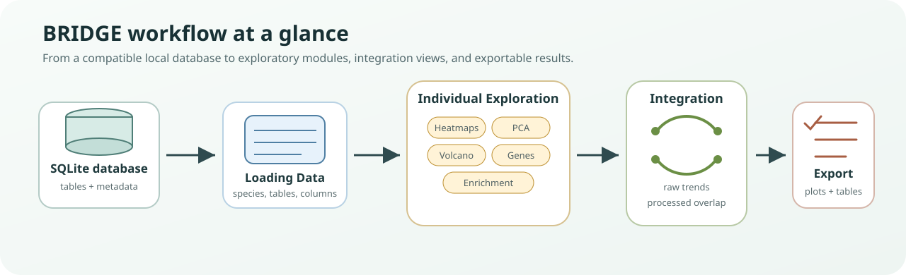

# Introduction

BRIDGE is built for users who want to analyze and integrate omics datasets through an interface instead of writing analysis scripts for every step.

Core idea:

- Data live in a local SQLite database.
- You load selected tables and columns through the sidebar.
- BRIDGE creates per-dataset analysis workspaces.
- You can compare datasets through raw and processed integration.

*Workflow figure. BRIDGE starts from a compatible SQLite database, loads selected tables and datapoints, creates individual exploration workspaces, supports raw or processed integration, and ends with exportable plots and tables.*

Help: how to read this workflow

Think of BRIDGE as a guided path rather than a single plot. The database is the source of truth, Loading Data chooses what enters the session, Individual Exploration checks each dataset on its own, and Integration compares datasets once they are loaded and comparable.

Two main workflows:

- Individual Exploration:
  inspect one loaded dataset at a time with module tabs.
- Integration:
  combine multiple loaded datasets to compare trends and significant signals across omics layers.

Typical session:

1. Generate or open a BRIDGE-compatible database.
2. Load one or more datasets.
3. Explore each dataset individually.
4. Run raw or processed integration.
5. Export tables/plots for reporting.

If you want the exact processing and integration logic, read [Methodology](methodology.md).

Scope note:

- The backend is species-aware through naming conventions.
- The current UI species selector is configured around zebrafish workflows.
