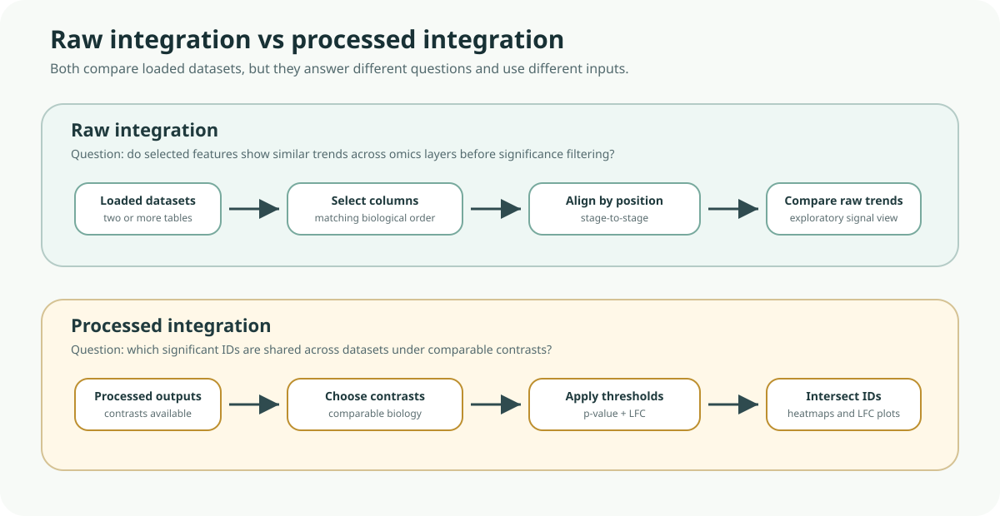

# Methodology

This page explains exactly what BRIDGE does in the app, especially for processing and integration workflows.

## Scope of the methodology

BRIDGE provides an integrated analysis workflow in a GUI. It combines established statistical routines and data operations into one user workflow.  
It does **not** claim a novel standalone statistical integration algorithm.

## End-to-end workflow

1. Load selected table columns and matching annotation from SQLite.
2. Build or reuse processed objects (cache-backed).
3. Run individual analysis modules (heatmap, volcano, gene expression, enrichment, PCA).
4. Run raw or processed integration across loaded datasets.
5. Export tables and plots.

*Methodology figure. Raw integration compares selected datapoint columns directly, while processed integration filters contrast-level results first and then intersects significant IDs across datasets.*

Help: how to read this comparison

Use raw integration when you want an exploratory trend comparison across selected columns. Use processed integration when you want to focus on features that are significant under comparable contrasts in every selected dataset. The two workflows are complementary, not interchangeable.

## Default per-dataset processing in BRIDGE

### Proteomics

- Build unique IDs from `Gene_Name` and `Protein_ID`.
- Parse selected datapoints into a DEP2-compatible object.
- Apply filtering, `MinDet` imputation, and VSN normalization.
- Run differential testing with all-vs-all style contrasts and BH correction.
- Mark significant features with p-value/LFC criteria.

### Phosphoproteomics

- Build unique IDs from `Protein_ID` and `pepG`.
- Parse selected datapoints into a DEP2-compatible object.
- Apply filtering, `MinDet` imputation, and VSN normalization.
- Run differential testing with all-vs-all style contrasts and BH correction.
- Mark significant features with p-value/LFC criteria.

### RNA-seq

- Parse selected count columns into a DEG/DEP2-style object.
- Apply filtering.
- Run differential testing.
- Mark significant features with p-value/LFC criteria.

## Raw integration methodology

Raw integration is a column-aligned comparative merge.

- Requires at least two loaded datasets.
- Requires selected datapoint columns for each dataset.
- Requires equal number of selected datapoint columns across datasets.
- Aligns selected columns positionally to the first selected dataset.
- Builds a combined table with a `source` column.
- Uses identifier-aware `unique_id` logic per datatype for cross-table plotting.

Use case:

- trend comparison and exploratory cross-omics inspection before significance filtering.

## Processed integration methodology

Processed integration is an overlap-based comparative workflow.

- Requires one selected contrast per dataset.
- Applies user-defined p-value and LFC thresholds per selected contrast.
- Extracts significant feature IDs per dataset.
- Intersects IDs across all selected datasets.
- Subsets each dataset to the common intersected set.
- Builds integrated tables, heatmaps, and pairwise LFC scatter comparisons.

Important implementation note:

- The overlap/intersection is shared across datasets.
- Clustering is computed per dataset matrix in the current implementation.

## What “integration” means in BRIDGE

In BRIDGE, integration means coordinated comparison of multiple omics datasets within one workflow:

- raw-level aligned comparison across selected datapoints
- processed-level overlap analysis across significant features

This supports comparative biological interpretation, but it is distinct from methods that infer a new latent multi-omics model.

## Assumptions and limitations

- Input naming conventions and identifiers must be consistent.
- Contrast comparability across datasets is critical for interpretation.
- Strict thresholds can produce small intersections.
- One-to-many mappings (especially phosphoproteomics) can affect one-to-one comparisons.
- Current UI species selector is configured around zebrafish workflows.
