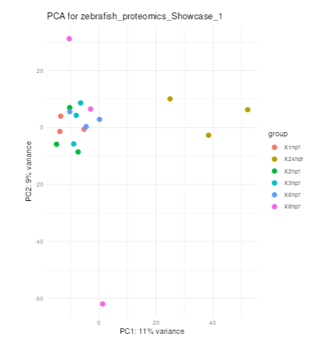

# PCA

Purpose:

- summarize global variance structure across samples
- inspect sample relationships and possible batch-like effects

Inputs:

- one loaded dataset with processed object

How to use:

1. Open `PCA`.
2. Click compute.
3. Inspect clustering/separation of samples.
4. Review loading table for feature contributions.

Outputs:

- PCA plot
- loading/contribution table

Interpretation tips:

- Clear group separation can indicate strong condition effects.
- Unexpected grouping can indicate technical variation or annotation issues.
- Pair PCA interpretation with raw/de views before filtering decisions.

*Figure 6. PCA scatter plot for a loaded dataset. Each point is a sample or replicate, colors indicate groups or stages, and the axes show the first two principal components with the percentage of variance explained.*

Help: how to read this plot

Samples that are close together have more similar overall profiles, while samples that separate strongly differ across many features. Clear grouping can indicate biological structure, but unexpected separation may also suggest batch effects, outliers, or annotation issues. Use the loading table to inspect which features contribute most to the visible separation.

