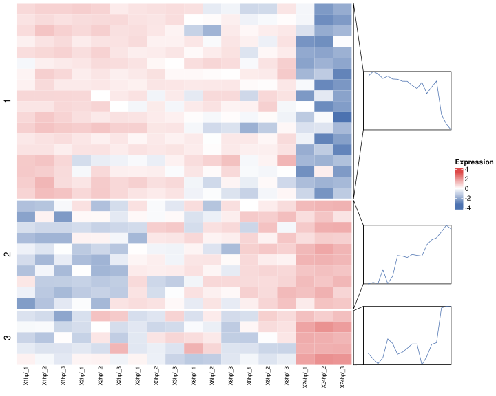
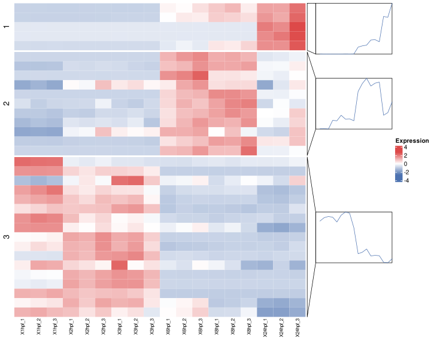

# Processed Integration

Purpose:

- integrate datasets based on significant differential signals
- focus on intersecting IDs across selected omics layers

Requirements:

- at least two loaded datasets
- one selected contrast per dataset
- p-value and LFC thresholds
- cluster number `k`

How to use:

1. Open `Processed Integration`.
2. Select datasets.
3. Select one comparison/contrast per dataset.
4. Set p-value and LFC thresholds.
5. Set `k`.
6. Click integrate.

Workflow summary:

1. Filter each dataset by selected contrast and thresholds.
2. Intersect significant IDs across datasets.
3. Build processed tables and matrices from intersected IDs.
4. Render integrated heatmaps and trend views.
5. Render LFC scatter comparisons where compatible.

Outputs:

- processed integrated tables
- integrated heatmaps
- cluster tables
- LFC scatterplot comparisons

Interpretation tips:

- Use biologically comparable contrasts across datasets.
- If intersection is too small, relax thresholds.
- Check preview dimensions before interpreting cluster patterns.

For exact methodological scope, see [Methodology](methodology.md).

*Figure 8. Processed Integration heatmaps for the shared significant feature set across selected datasets. Each heatmap summarizes an integrated dataset after contrast-level filtering and ID intersection, with side profiles showing cluster-level expression trends.*

Help: how to read this plot

Processed integration first filters each dataset by the selected contrast and thresholds, then keeps only IDs shared across all selected datasets. The heatmaps show how those shared significant features behave in each dataset. Interpret strong shared patterns as candidate cross-omics signals, but remember that strict thresholds or one-to-many mappings can strongly affect which IDs remain in the intersection.

