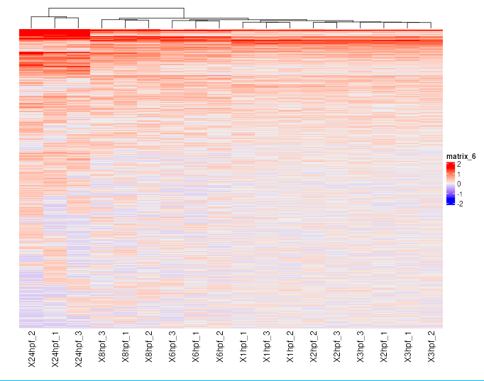

# Raw Heatmap

Purpose:

- visualize unprocessed expression patterns across selected datapoints
- detect broad trends and obvious quality issues

Inputs:

- one loaded dataset
- selected datapoint columns from `Loading Data`

How to use:

1. Open `Raw Heatmap` tab in a loaded dataset.
2. Click the compute button.
3. Inspect global intensity patterns across rows and columns.

What to look for:

- strong global shifts between stages/conditions
- outlier-like samples
- unusually flat or noisy signal regions

Notes:

- This module is for first-pass inspection.
- It does not apply significance filtering.

*Figure 1. Raw Heatmap view after compute. Warmer colors indicate higher relative signal and cooler colors indicate lower relative signal across the selected datapoints. Use the column clustering and broad color bands to spot stage-level similarity, global shifts, or potential outlier samples.*

Help: how to read this plot

Each column is a selected datapoint or replicate, and each row is a measured feature. Columns that branch together at the top have more similar overall profiles. This plot is best used as a first-pass quality and pattern check; it does not by itself establish statistical significance.

