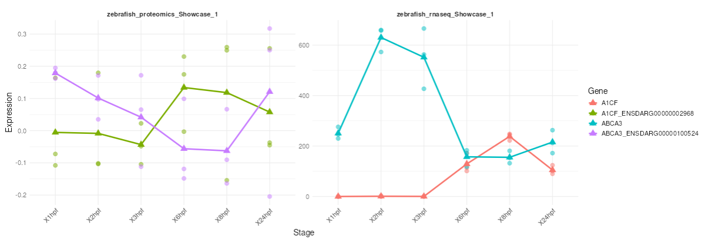

# Raw Integration

Purpose:

- compare multiple loaded datasets at raw level
- inspect cross-omics trends before significance filtering

Requirements:

- at least two loaded datasets
- selected datapoint columns for each dataset
- equal number of selected datapoint columns across datasets

How to use:

1. Open `Raw Integration`.
2. Select datasets to integrate.
3. Choose datapoint columns for each dataset.
4. Check preview for column alignment.
5. Click integrate.

Outputs:

- integrated raw table (with source table label)
- integrated datapoints plot for selected genes

Practical tips:

- Use matching biological stages/conditions across datasets.
- Alignment is positional, so order matters.
- In phosphoproteomics, one gene can map to multiple peptide lines.

For exact methodological scope, see [Methodology](methodology.md).

*Figure 7. Raw Integration output comparing selected features across two loaded datasets. Each panel shows one source dataset, with points representing replicate-level values and connected markers summarizing stage-wise trends for the selected genes or identifiers.*

Help: how to read this plot

Use this view to compare whether a feature follows a similar or different trend across omics layers before applying differential-expression filtering. Because raw integration aligns selected datapoint columns by position, make sure the stages or conditions are selected in the same biological order for every dataset before interpreting the trends.

