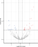

# Volcano Plot

Purpose:

- inspect differential expression for a selected contrast
- prioritize strongly changing and significant features

Inputs:

- one loaded dataset with processed output
- selected contrast
- p-value cutoff
- LFC cutoff
- optional feature highlight search

How to use:

1. Open `Volcano Plot`.
2. Choose contrast.
3. Set p-value and LFC cutoffs.
4. Optionally search/highlight features.
5. Click compute.

Outputs:

- interactive volcano plot
- significant-feature table for export

Interpretation tips:

- Upper-left / upper-right regions typically capture strong regulated features.
- Check that highlighted candidates behave as expected under chosen contrast.
- Use same thresholds when comparing across runs.

*Figure 3. Volcano Plot after compute. Each point is a feature in the selected contrast; the x-axis shows log2 fold change and the y-axis shows statistical evidence as `-log10(p-value)`. Dashed lines mark the selected LFC and p-value cutoffs.*

Help: how to read this plot

Features farther left or right have larger effect sizes, and features higher on the plot have stronger statistical evidence. Points in the upper-left and upper-right regions are usually the most interesting candidates. Gray points do not pass the selected thresholds, while colored points pass the significance and direction criteria.

